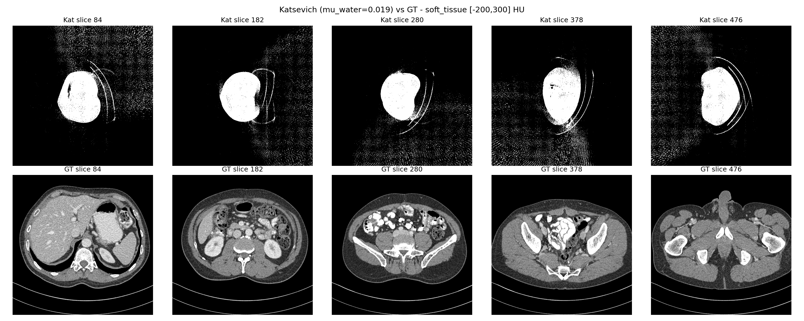
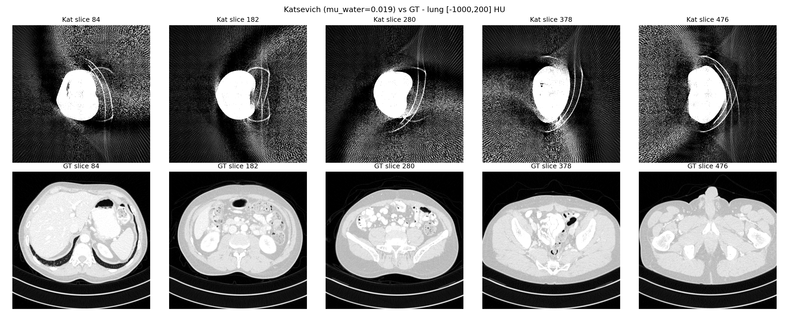
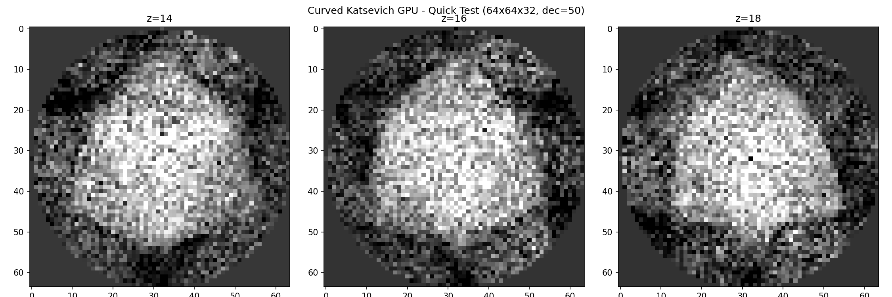
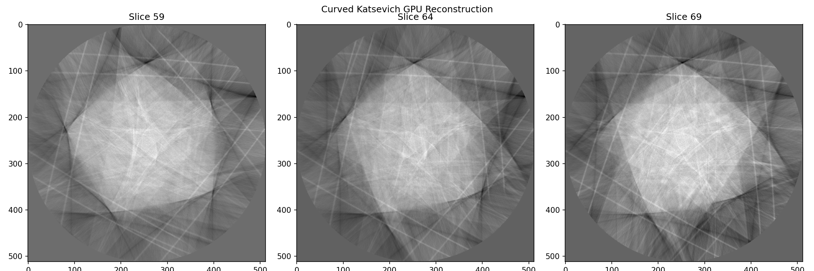

# 螺旋CT Katsevich 重建 — 周进度报告

# Helical CT Katsevich Reconstruction — Weekly Progress Report

---

## 背景 / Background

项目目标：使用 Katsevich 精确滤波反投影算法对 AAPM L067（Siemens 螺旋CT）的 DICOM-CT-PD 投影数据进行重建。原始 `pykatsevich` 库仅实现了**平板探测器**公式，但 Siemens 扫描仪使用的是**弧形（等角）探测器**，导致重建图像中人体尺寸偏小约 9%，且存在明显伪影。

Goal: Reconstruct AAPM L067 (Siemens helical CT) DICOM-CT-PD projection data using the Katsevich exact filtered backprojection algorithm. The existing `pykatsevich` library only implements **flat-detector** formulas, but the Siemens scanner uses a **curved (equi-angular) detector**, causing ~9% body size underestimation and visible artifacts.

---

## 一、问题诊断（前期工作）/ Problem Diagnosis (Prior Work)

| 问题 Issue | 发现 Finding |
|-----------|-------------|
| **FOV 不匹配** FOV mismatch | DICOM 中的探测器像素尺寸 (0.502mm) 是等角弧长（在等中心处），不是物理平板间距。DICOM pixel size is equi-angular arc-length at isocenter, not physical flat-detector spacing. |
| **放大倍率修正** Magnification | 应用 ×SDD/SOD = 1.824 修正后，人体从 ~60% 增大到 ~75-80%。Body increased from ~60% to ~75-80% of image. |
| **等角→平板重采样** Resampling | 在 `dicom.py` 中实现重采样，但人体仍比 ground truth 小约 9%。Implemented in `dicom.py`, but body still ~9% smaller than GT. |
| **根本原因** Root cause | pykatsevich 整个滤波流程（微分、rebin、反投影）使用平板公式，对弧形探测器数据数学上不精确。Entire filtering pipeline uses flat-detector math — incorrect for curved-detector data. |

前期重建结果（平板公式 + 重采样 workaround）/ Prior results (flat formulas + resampling workaround):



上排 Top: Katsevich 重建（可见螺旋伪影、尺寸偏小）— Katsevich recon (spiral artifacts, undersized body)

下排 Bottom: Ground truth 参考 — Ground truth reference



---

## 二、本周工作 / This Week's Work

### 2.1 CPH CT Toolbox 源码分析 / Source Analysis

安装并深入阅读了 `cphcttoolbox`（pykatsevich 的原始来源），发现它同时支持 `flat` 和 `curved` 探测器。逐行对比梳理了弧形与平板 Katsevich **五个核心步骤的数学差异**：

Installed and studied `cphcttoolbox` (original source of pykatsevich). Documented mathematical differences across all 5 pipeline steps:

| 步骤 Step | 平板 Flat | 弧形差异 Curved Difference |
|-----------|---------|--------------------------|
| **微分 Differentiate** | 8 邻域模板 (d_proj+d_col+d_row) | 4 邻域（无 d_row），长度修正 `R/√(R²+row²)` |
| **前向 rebin Fwd Rebin** | `scale × (κ + κ/tan(κ) × col/SDD)` | `scale × (κ×cos(γ) + κ/tan(κ)×sin(γ))` |
| **Hilbert 卷积 Conv** | 相同 Same | 相同 Same |
| **反向 rebin Rev Rebin** | 线性插值 Linear interp | 线性插值 **+ cos(γ) 加权** |
| **反投影 Backproject** | 列投影 `col = t/U × SDD` | 列投影 `col = arctan(t/U)`，行含 `cos(γ)` |
| **T-D 边界 Bounds** | `(col² + SDD²) × arctan(col/SDD)` | `(π/2 + γ) / cos(γ)` |
| **pixel_span** | mm（物理宽度） | **弧度 radians**（角度步长）！ |

### 2.2 Python 3 移植 / Python 3 Port: `curved_katsevich_demo.py`

将 CPH CT Toolbox 的弧形探测器 Katsevich 从 Python 2 移植为 Python 3 独立脚本。

Ported CPH CT Toolbox's curved Katsevich from Python 2 to standalone Python 3:

- 移除插件架构，直接使用 dict 配置 / Removed plugin architecture, direct dict config
- 修复 `xrange→range` 等 Py2/3 兼容问题 / Fixed Python 2→3 issues
- 修复微分输出尺寸 bug（CPH 约定：写入 `[:-1, :-1]`，最后行/列置零）/ Fixed differentiation shape bug
- 用玩具数据验证全部 5 步（8×16 探测器，32 投影，8³ 体积）/ Verified all 5 steps with toy data

### 2.3 GPU 加速实现 / GPU Implementation: `curved_katsevich_gpu.py`

基于 CuPy + CUDA 实现 GPU 加速版本 / Built GPU-accelerated version using CuPy + CUDA:

| 模块 Module | 实现 Implementation | 加速 Speedup |
|------------|-------------------|-------------|
| **微分 Diff** | NumPy 向量化（无 Python 循环） | ~100× |
| **前向 rebin** | 预计算索引表 + 向量化 gather | ~50× |
| **Hilbert 卷积** | `scipy.signal.fftconvolve` | ~20× |
| **反向 rebin** | 预计算索引/分数表 + 向量化 | ~50× |
| **反投影 BP** | CuPy RawKernel CUDA（16×16 线程块） | GPU 原生 |

CPU vs GPU 验证：微分精确匹配，其他步骤误差 < 1e-4。

CPU vs GPU validation: differentiation exact match, other steps error < 1e-4.

快速测试（64³, dec=50）— 8.3 秒完成 / Quick test — 8.3s:



### 2.4 DICOM 加载器修复 / DICOM Loader Fix

原始加载器问题 / Original issues:
- pitch 估算粗糙 (`pixel_height × det_rows × 0.46`) / Rough pitch estimate
- 角度未排序、未 unwrap / Unsorted, unwrapped angles
- 缺少 RescaleSlope/Intercept / Missing rescale

修复后 `load_dicom_projections` / Rewritten loader:
- **两遍扫描 Two-pass**: 先读元数据（`stop_before_pixels`）按 InstanceNumber 排序，再读像素
- **角度处理 Angles**: `np.unwrap()` 解缠绕
- **Pitch 提取优先级 Priority**:
  1. 表位置标签 `(0x0018, 0x9327)` → `pitch = mean(Δtable / Δangle)`
  2. `DetectorFocalCenterAxialPosition (0x7031, 0x1002)` 备选
  3. `SpiralPitchFactor (0x0018, 0x9311) × collimation / 2π` 兜底

**结果 Result: L067 → pitch = 22.97 mm/turn, 48590 投影, 21.09 圈**

### 2.5 角度符号约定 / Angle Sign Convention

L067 角度从 +4.68 递减到 -127.72 rad（顺时针），但 Katsevich 要求 source_pos 单调递增。

L067 angles decrease from +4.68 to -127.72 rad (clockwise), but Katsevich requires monotonically increasing source_pos.

解决方案 / Solution:
- 检测递减角度 → 取反 + 水平翻转投影列（等价于 y 轴镜像）
- `finalize_conf()` 新增 `actual_angles` 参数，使用 DICOM 真实角度作为 source_pos

---

## 三、当前状态 / Current Status

### 已完成 Completed

- 弧形探测器 Katsevich 完整实现（CPU 参考 + GPU 加速）/ Full curved-detector Katsevich (CPU + GPU)
- DICOM 正确提取 pitch = 22.97 mm/turn 和角度 / Correct pitch & angle extraction
- 端到端流水线（512×512×128, dec=5, 9718 投影 → 145 秒）/ End-to-end pipeline runs

### 中分辨率测试 / Medium-Resolution Test (512×512×128, voxel=0.664mm)

流水线成功运行，可见人体结构，但**存在条纹伪影** / Pipeline runs, body visible, but **streak artifacts present**:



初步分析 / Analysis:
- 角度归一化修复（取反+翻转列）在最后实现，尚未应用到此次测试 / Angle normalization not yet applied to this test
- 重建体积 z 范围仅覆盖扫描一小部分（~85mm / 484mm），需对齐 z 中心 / z-center alignment needed

### 待解决 Remaining Work

1. **验证角度归一化** — 使用取反角度+翻转列重新重建 / Validate angle normalization fix
2. **z 中心对齐** — 重建体积 z=0 对应扫描中心 / Align reconstruction z-center with scan midpoint
3. **Ground truth 对比** — 全分辨率 512×512×560 重建，测量尺寸匹配度 / Full-res comparison
4. **最终验证** — 弧形公式是否修正 9% 缩放误差 / Confirm curved formulas fix scaling error

---

## 四、文件清单 / File Inventory

| 文件 File | 说明 Description |
|----------|-----------------|
| `curved_katsevich_demo.py` | CPU 参考实现（Python 3 移植 + DICOM 加载器）/ CPU reference + DICOM loader |
| `curved_katsevich_gpu.py` | GPU 加速版本（CuPy CUDA 反投影）/ GPU-accelerated (CuPy CUDA BP) |
| `curved_gpu_quick.png` | 快速测试（64³, dec=50）/ Quick test |
| `curved_recon_gpu.png` | 中分辨率测试（512², dec=5）/ Medium-res test |

---

## 五、关键几何参数 / Key Geometry (AAPM L067)

```
SOD = 595.0 mm        SDD = 1085.6 mm       放大倍率 Magnification = 1.825
探测器 Detector: 736 cols × 64 rows
等角步长 Angular step: δγ = 0.000844 rad (0.0484°/channel)
行高 Row height (at detector): 0.9265 mm
Pitch: 22.97 mm/turn (从表位置标签提取 from table position tags)
总投影 Total projections: 48,590
总圈数 Total turns: 21.09
```
